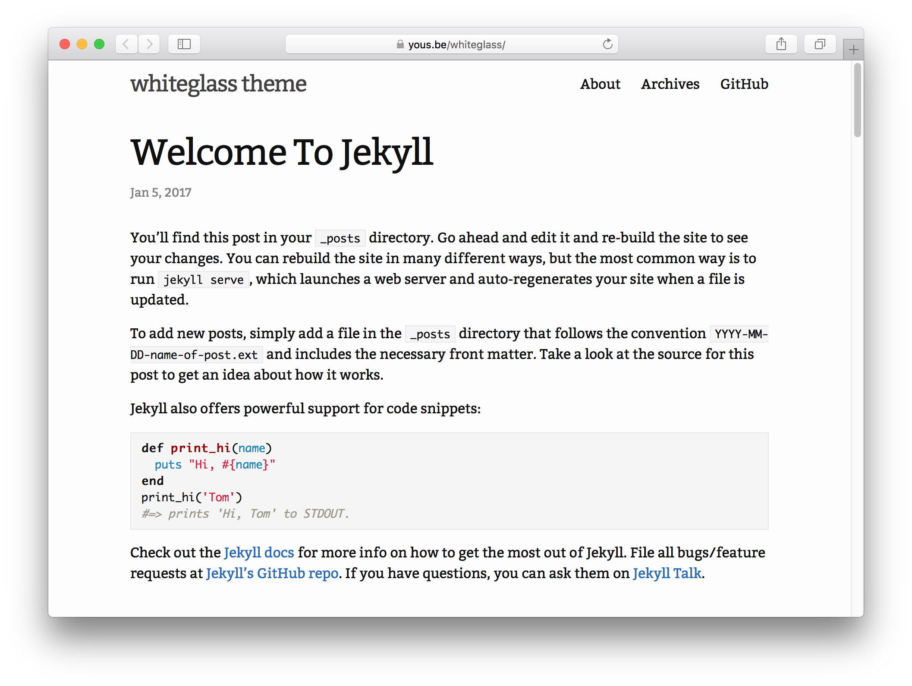

# whiteglass

[](https://badge.fury.io/rb/jekyll-whiteglass)
[](https://travis-ci.org/yous/whiteglass)

Minimal, responsive Jekyll theme for hackers.



## Installation

Add this line to your Jekyll site's Gemfile:

``` ruby
gem "jekyll-whiteglass"
```

And add this line to your Jekyll site's `_config.yml`:

``` yaml
theme: jekyll-whiteglass
```

And then execute:

``` sh
bundle
```

Or install it yourself as:

``` sh
gem install jekyll-whiteglass
```

## Quick Start

1. Generate a new Jekyll blog:

   ``` sh
   jekyll new blog --skip-bundle
   cd blog
   ```

2. Edit `Gemfile` to use whiteglass theme:

   ``` ruby
   gem "jekyll-whiteglass"
   ```

3. Edit `_config.yml` to use whiteglass theme and its plugins:

   ``` yaml
   theme: jekyll-whiteglass
   plugins:
     - jekyll-archives
     - jekyll-paginate
     - jekyll-sitemap

   permalink: /:year/:month/:day/:title/
   paginate_path: /posts/:num/
   paginate: 5

   jekyll-archives:
     enabled:
       - categories
       - tags
     layout: category_archives
     permalinks:
       category: /categories/:name/
       tag: /tags/:name/
   ```

4. Copy
   [`index.html`](https://github.com/yous/whiteglass/blob/master/index.html),
   [`about.md`](https://github.com/yous/whiteglass/blob/master/about.md),
   [`archives.md`](https://github.com/yous/whiteglass/blob/master/archives.md),
   [`feed.xml`](https://github.com/yous/whiteglass/blob/master/feed.xml), and
   [`_data/navigation.yml`](https://github.com/yous/whiteglass/blob/master/_data/navigation.yml)
   from the theme:

   ``` sh
   rm index.md
   curl -L -O "https://github.com/yous/whiteglass/raw/master/{index.html,about.md,archives.md,feed.xml}"
   curl -L --create-dirs -o _data/navigation.yml https://github.com/yous/whiteglass/raw/master/_data/navigation.yml
   ```

5. Install gems and you're good to go! The blog will be available on
   `http://127.0.0.1:4000`.

   ``` sh
   bundle install
   bundle exec jekyll serve
   ```

## Usage

### Customization

To override the default structure and style of whiteglass, simply create the
concerned directory at the root of your site, copy the file you wish to
customize to that directory, and then edit the file. e.g., to override the
[`_includes/footer_content.html`](_includes/footer_content.html) file to add
contents to footer, create an `_includes` directory, copy
`_includes/footer_content.html` from jekyll-whiteglass gem folder to
`<your-site>/_includes` and start editing that file.

For example, you can add favicons to `_includes/head_custom.html`:

``` html
<link rel="icon" type="image/x-icon" href="{{ "/favicon.ico" | relative_url }}">
<link rel="apple-touch-icon" href="{{ "/apple-touch-icon.png" | relative_url }}">
<link rel="apple-touch-icon" sizes="76x76" href="{{ "/apple-touch-icon-76x76.png" | relative_url }}">
<link rel="apple-touch-icon" sizes="120x120" href="{{ "/apple-touch-icon-120x120.png" | relative_url }}">
<link rel="apple-touch-icon" sizes="152x152" href="{{ "/apple-touch-icon-152x152.png" | relative_url }}">
<link rel="apple-touch-icon" sizes="180x180" href="{{ "/apple-touch-icon-180x180.png" | relative_url }}">
```

The site's default CSS is in the gem itself,
[`assets/main.scss`](assets/main.scss). To override the default CSS, the file
has to exist at your site source. Do either of the following:

- Create a new instance of `main.scss` at site source
  - Create a new file `main.scss` at `<your-site>/assets/`
  - Add the frontmatter dashes, and
  - Add `@import "whiteglass";`, to `<your-site>/assets/main.scss`
  - Add your custom CSS
- Download the file from this repo
  - Create a new file `main.scss` at `<your-site>/assets/`
  - Copy the contents at [`assets/main.scss`](assets/main.scss) onto the `main.scss` you just created, and edit away
- Copy directly from jekyll-whiteglass gem
  - Go to your local jekyll-whiteglass gem installation directory (run `bundle show jekyll-whiteglass` to get the path to it)
  - Copy the `assets/` folder from there into the root of `<your-site>`
  - Change whatever values you want, inside `<your-site>/assets/main.scss`

### Locale

`site.lang` is used to declare the primary language for each web page within the
site.

`lang: en-US` sets the `lang` attribute for the site to the United States flavor
of English, while `en-GB` would be for the United Kingdom style of English.
Country codes are optional and the shorter variation `lang: en` is also
acceptable. You may want to write a post in different language, then add `lang`
attribute to the frontmatter of that post:

``` yaml
layout: post
title: "안녕하세요"
lang: ko
```

### Description

`site.description` describes the site. This is mainly used in meta descriptions
for improving SEO. Also, you can set `description` attribute for each post:

``` yaml
layout: post
title: Awesome Post
description: This is an awesome post.
```

If you don't specify `post.description`, then `post.excerpt` will be used if it
exist.

### External URL

`external-url` turns the title of your post to a link. Specify a URL which you
want to link to.

``` yaml
layout: post
title: Jekyll whiteglass theme
external-url: https://github.com/yous/whiteglass
```

Then the title of your post would look like a link with text
`Jekyll whiteglass theme →`. This also applies to your blog feed.

### Category

Each post can have `categories` attribute. It can be a string or an array. This
will be displayed on index, archive and each post, and provide a link to the
archive of category.

``` yaml
layout: post
title: Awesome Post
categories: Misc
```

``` yaml
layout: post
title: Another Awesome Post
categories:
  - Misc
  - Idea
```

### Tag

Each post can have `tags` attribute. It can be a string or an array. This will
be displayed on index, archive and each post, and provide a link to the archive
of tag.

``` yaml
layout: post
title: Awesome Post
tags: food
```

``` yaml
layout: post
title: Another Awesome Post
tags:
  - food
  - trip
```

### Feed

Create `<your-site>/feed.xml` with:

``` yaml
---
layout: feed
---
```

If you want to use another path for feed, you can specify a non-default path via
your site's config.

``` yaml
feed:
  path: atom.xml
```

Then create `<your-site>/atom.xml` with the same content of `feed.xml` above.

### Comments

whiteglass provides the ability to include your favourite commenting service, like [Disqus](https://disqus.com) or [Isso](https://posativ.org/isso).

To enable comments on pages and posts:
1. Overwrite the `_includes/custom_comments_provider.html` with your custom provider of comments.
2. Add `comments: true` to your `_config.yml`.

To disable comments on certain pages or posts specify `comments: false` in the front matter of the page or post.

### Metadata for SEO

#### Keywords

Each post can have `keywords` attribute. This is a comma-separated list which is
used in meta descriptions for improving SEO.

``` yaml
layout: post
title: How to configure jekyll-whiteglass
keywords: jekyll, whiteglass, github pages
```

YAML list is also available:

``` yaml
keywords:
  - jekyll
  - whiteglass
  - github pages
```

#### Twitter

- `site.twitter_username` sets `twitter:site` and `twitter:creator` meta tag
- `site.twitter_image` sets `twitter:image:src` meta tag
- `page.twitter_card.type` sets `twitter:card` meta tag (default: `summary`)
  - If `page.twitter_card.type` is `gallery`, it sets `twitter:image0`, `twitter:image1`, `twitter:image2` and `twitter:image3` meta tags with `page.twitter_card.image`, `page.twitter_card.image1`, `page.twitter_card.image2` and `page.twitter_card.image3`, respectively
  - If `page.twitter_card.type` is `photo`, `page.twitter_card.width` sets `twitter:image:width` meta tag and `page.twitter_card.height` sets `twitter:image:height` meta tag
- `page.twitter_card.creator` sets `twitter:creator` meta tag. It overrides `site.twitter_username`
- `page.twitter_card.image` sets `twitter:image:src` meta tag if `page.twitter_card.type` is not `gallery`. It overrides `site.twitter_image`

#### Facebook

- `site.facebook_app_id` sets `fb:admins` meta tag
- `site.facebook_page` sets `article:author` meta tag
- `site.facebook_image` sets `og:image` meta tag
- `page.facebook.image` sets `og:image` meta tag. It overrides `site.facebook_image`

### Navigation

To define header links, add titles and URLs under the `main` key in
`_data/navigation.yml`:

``` yaml
main:
  - title: "About"
    url: /about/
  - title: "Archives"
    url: /archives/
  - title: "GitHub"
    url: https://github.com/yous/whiteglass
```

### Enabling Google Analytics

To enable Google Analytics, add the following lines to your Jekyll site:

``` yaml
google_analytics: UA-NNNNNNNN-N
```

## Contributing

Bug reports and pull requests are welcome on GitHub at
<https://github.com/yous/whiteglass>. This project is intended to be a safe,
welcoming space for collaboration, and contributors are expected to adhere to
the [Contributor Covenant](http://contributor-covenant.org) code of conduct.

## Development

To set up your environment to develop this theme, run `bundle install`.

Your theme is setup just like a normal Jekyll site! To test your theme, run
`bundle exec jekyll serve` and open your browser at
`http://localhost:4000/whiteglass/`. This starts a Jekyll server using your
theme. Add pages, documents, data, etc. like normal to test your theme's
contents. As you make modifications to your theme and to your content, your site
will regenerate and you should see the changes in the browser after a refresh,
just like normal.

## License

The theme is available as open source under the terms of the
[MIT License](http://opensource.org/licenses/MIT).
